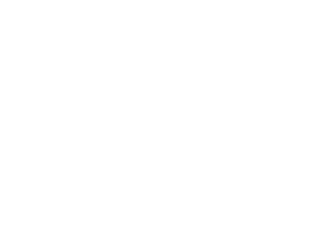
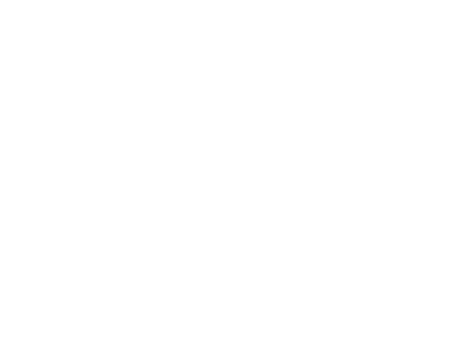
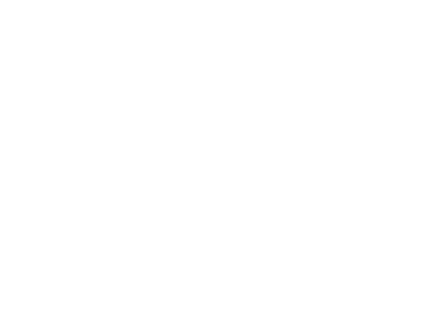

# Student Performance Prediction using Machine Learning

This project predicts student exam performance using Linear Regression based on various factors such as study hours, attendance, parental education, internet access, and previous marks.

## Technologies Used
- Python
- Pandas
- Matplotlib
- Scikit-learn

## Project Workflow
1. Dataset Loading
2. Data Cleaning
3. Data Visualization
4. Feature Selection
5. Train-Test Split
6. Model Training
7. Accuracy Evaluation
8. Prediction

## Dataset Features
- StudyHours
- Attendance
- ParentalEducation
- InternetAccess
- PreviousMarks

Target Variable:
- FinalScore

## Visualizations

### Study Hours vs Score

### Attendance vs Score

### Actual vs Predicted Scores

## Example Prediction

Input:
StudyHours = 6  
Attendance = 85  
ParentalEducation = 2  
InternetAccess = 1  
PreviousMarks = 72  

Predicted Score ≈ 52

## How to Run

1. Install required libraries
pip install pandas matplotlib scikit-learn notebook

2. Start Jupyter Notebook
jupyter notebook

3. Open the file
student_performance_prediction.ipynb

4. Run all cells to train the model and see predictions.

## Author
Smruti Apar
CSE(AI)